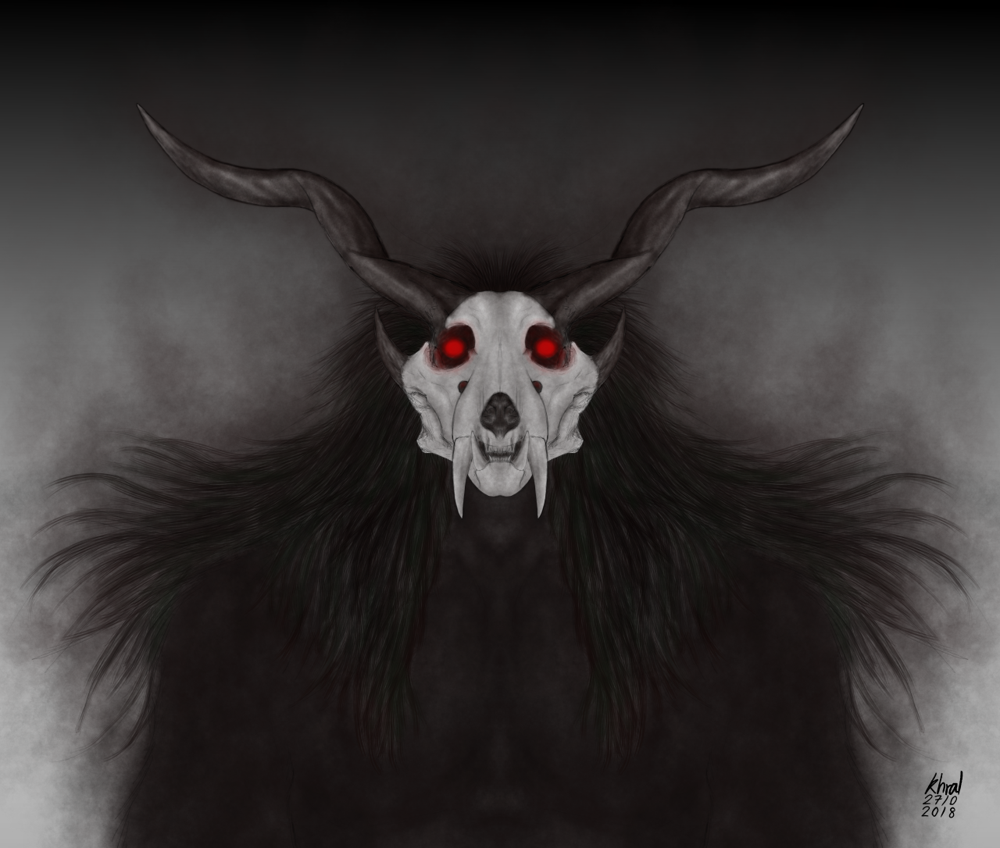
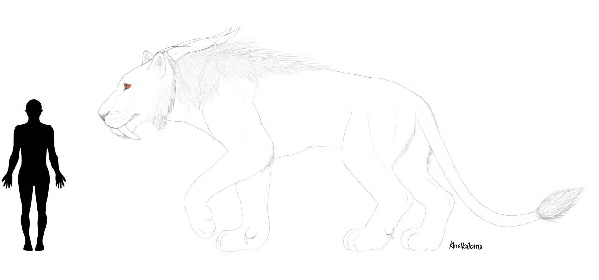

Rrowl-Telepath
==============

`This was still a WIP and in alpha quality at the moment, but it getting there :P`

**[Rrowl's true form - early and outdated concept art]**

**Name:** Rrowl-Telepath/Rrowl-Skarrowl

**Aliases:** Rrowl (Roughly translate from Old Rra-krr to English as “vengeance/retribution”), Scrawny-Little-One (birth name), Second-Telepath-of-Skarrowl-Clan (profession name), Incarnation of The Fanged God, The Fanged One, Lord of the Forest/Lord of the Savannah

**Race:** Unknown, some-kind-of-eldritch-shape-shifter. Formerly a Rra-krr/Smilodon (as called by Human).

**Gender:** Not applicable. Appear as a male in Rra-krr form and feral form, male personality.

**Age:** Appear as an adult in Rra-krr form. His appearance in Rra-krr form did not change since the day of The Hidden Temple Incident.

**Birthdate:** 14 of M'krrow 15017 (date is based 8) or in Earth's date, 12 October 2326.

**Birthplace:** Conqurer’s-Fang, one of battle ship of Zaar-Admiral (now known as Zaar-Skarrowl) small exploration party, orbiting newly discovered habitable planet similar to Rra-krr home world, which later named Shrres (mirror/reflection).

**Residence:** Bloody-Claw (Prowling Hunter class warship) or Shrres’s capital fortress

**Occupation:** Telepath of Skarrowl Clan

**Languages:** Rra-krr, Ancient, Drakor, Sol (English) and a dozen of other alien languages. (He can't speak perfect English due to his specie's mouth doesn't suitable for Earth's language. When he speak, he do have that weird accent like when you force a tiger to speak English for example.)

**Height (in Rra-krr form):** standing (hunched pose) about 230 cm (7.5 ft)

**Weight (in Rra-krr form):** about 210 kg (462 lb)

**Distinguishing marks:**

Rra-krr form

- Orange fur.
- Faint dark red/orange stripes.
- Dark red/orange shaggy mane.
- Blue eyes, with round pupils.
- Larger than average modern Rra-krr.

Fanged God form (feral form)

- Black fur.
- Black mane.
- Red eyes, with slit pupils.
- Curved horns (Kudu like horns).

**Relative:**

- Zarr-Skarrowl, foster sire
- Unknown biological sire
- Cinder-Tail, biological mother/mother

**Alignment:** Bacon

**Personality Traits:**

- `TODO`

**Equipment:**

- A traditional Rra-krr short sword/knife. this kind of blade is varies in making of the blade. It’s a status of Rra-krr’s adult hood, often use in ceremony and also function as a weapon or hunting tool). His blade is made with nearly indestructible material and both of the sharp side of the blade have build-in molecular disintegrator field generator that can be activated with a button on the hilt. When the field is activated, sharp side of the blade will give a slight blue glow, allowing it to cut through almost anything like a hot knife cut through butter by destroy the bond between molecules. The power source in the hilt can supply disintegrator field generator continuously for months before it need to recharge.
- A utility belt with tools, small pouches, small flasks of Nepeta-Leaves extract (aka. Rra-krr's mint tea) attached to a belt.
- A Rra-krr plasma pistol.
- He was usually wear minimal or no clothing, except on special occasion. His casual/hunting clothing consist of either a black or dark brown pants or usually, no pants, with two belts made from leather, one is utility belt that worn around his shoulder and another worn around his waist, waist belt is attached to his sword holder and scabbard at left side, his plasma pistol holsters attracted at right side, sometimes he is wearing Ceramite vest for extra protection against high powered projectile or energy weapons, just in-case.
His favorite clothing is powered armor, if that count as clothing :P
- He have his own space ship and a small crew of his own (although he isn’t the captain), the ship named Bloody-Claw, she was a very old Prowling Hunter class warship (comparable to human’s battle cruiser star ship class, but with a cloaking device), repaired, redecorate interior, retrofitted with many current technology and modified energy source from inferior fusion reactor to three redundant Zero-Point-Module, commissioned and gifted to him by the Patriarch and Zaar-Skarrowl. Although, it still have many outdated but upgraded systems. The ship have no heavy weapons system due to their weapon regulation law. (by “heavy weapon system” in Rra-krr's term is any single weapon system that powerful enough to destroy a continent on a planet in one shot).
Due to upgraded and modified systems and the ship equipped with an Advanced Interface Chair (a brain to computer interface device, standard among Rra-krr space craft, use by telepath to pilot the ship in hyperspace), the Bloody-Claw can be pilot by 1 pilot by using the chair. Although the ship require at lest 3 pilot, with one telepath using the chair to aid navigation systems when travel in hyperspace for optimal operation.
He sometimes also use the ship as his den.

**Power/Abilities:**

Due to him being a Rra-krr telepath, he have the usual powers/abilities of those telepath, like telepathy, limited precognition etc. but after an incident with the remain of oddly looking creature during an archaeological trip in the Hidden Temple, He was transformed in to... something..., which give him great power and many abilities, for example, ability to change his form between 3 forms at will or phase through matter or traverse other dimension/other universe or extra sensory that enable him to "see" the soul of any being.

While the power he received was superb and cool, it a bit more like a curse as his default form was now that of eldritch monster thingy that make him difficult with others, as in his universe and probably other too, this form is beyond mortal being to comprehend, or more likely it did some kind of mind trick to the one seeing him, so anyone looking at him will probably gone nut. along with unsustainable hunger for living being fresh, blood and... soul? that still linger in his mind, even when he was in Rra-krr form.

He also have some kind of precognition abilities as sometimes he have a vision of very important things that will or may happen in near future in his dreams, this greatly enhanced to be very accurate after the Hidden Temple Incident.

He can also disguise himself to any living being that other(s) is expected to see or he expected other(s) to see, even in Fanged God form (feral form) or in true form, by using his psychic abilities to project false perception of him self. Although, the down side is it only affect the mind, not his physical body, so any machine can still detect him. In Rra-krr form it require lots of concentration and he would unable to feel/sense emotional state or thought of those around him if not taking Nepeta-Leaves extract due to limitation of Rra-krr’s physiology.

**Rra-krr form**

The Rra-krr form is looks just like him before the Hidden Temple Incident, not much is difference from the old him. Due to that incident have transformed him in to... something, he now have enhanced telepathic sense, strength, and speed compared to before the incident, although is just in the area of those top Rra-krr. He still require to consume Nepeta-Leaves extract (Rra-krr’s telepathic enhancement drug aka. Rra-krr’s mint tea) to enhance his telepathic sense when doing telepath things in this form.

In this form, as with typical Rra-krr telepath, if he did not consume Nepeta-Leaves extract, he have very limited telepathy. With physical contact, his telepathic sense are more effective, he can do few things that he can only do when he was on Nepeta-Leaves extract, like mind reading, send thought/emotions, forced the subject to sleep, etc. but is very limited and require some concentration.

Since he can’t read mind in this form without physical contact or consume Nepeta-Leaves extract, he can only guess the subject’s thought based on what he feel/sense from the subject, with very high accuracy due to training.

When using Nepeta-Leaves extract, his telepathic senses are greatly enhance. At this state, the maximum effective range is increase, he will have full telepathic abilities, such as mind reading, send thought/emotion or vision, memory probing, psychic communication with others, temporary replicate knowledge and skills of others, etc.

With shorter range, his telepathic power is stronger, at less than 50-100 m, he can send pain directly to his enemy’s brain, fry part of it or rupture some vein in their brain with sensory overload or temporary paralyze or rip their mind to pieces, or torture them with the worse of worse things in a mental loop. Note: This is not single target abilities!

In range longer than the maximum effective range, he have limited telepathy, like sense psychic present within a star system for example.

The down side of this form is he can't always maintain this form. When he was unconscious or psychically unstable such as when he was asleep or in high mental stress, he will likely turned back to true form.

**Fanged God form or feral form**

This form is a much more family friendly version of his true form. He know of this form as a distant memory he received while he was in painful transformation from a Rra-krr into what he is now. In this form, he bear resemblance to a large black furred saber-toothed big-cat-like creature, with black mane, red eyes and slit pupils, lion like tail, a pair of horns and a pair of ears, that walk on four legs like Earth's big cats. This form is varies in size depending on his will, the usual size is about 220 cm (7.2 ft) measure from shoulder to feet.

In this form, he have enhance strength, speed and endurance, able to do all telepath things without taking Nepeta-Leaves extract, even better, his telepathic ability is greatly improve, surpassed the most powerful telepathic being in explored space (and possibly beyond) and given him access to various powers he received from The Hidden Temple incident. Such as extra sensory that enable him to "see" the soul of any being, able to phase through matter or ability to teleport to anywhere he desired or traverse to/from other dimension/other universe. Although the abilities is a lots less powerful than when he was in true form.

This form also "accidentally" look like those depicted in Rra-krr's art as a representation of The Fanged God, a Rra-krr's deity. And due to this, he rarely shape-shift into this form, as it might cause some chaos among the religious Rra-krr if being seen.

**True form**

**[early and outdated concept art]**

The last one is true form, which is what he was turned into after The Hidden Temple Incident. In this form, he appear as some kind of terrifying (for some) big cat monster thingy that looks like the result of unholy combination of flesh, fur and bones. The head was looks like a saber-tooth cat skull, red glowing eyes in empty eyes socket, two pair of horns (the head is kinda looks like Charr's skull), long black fluffy mane and long barbed tongue. The body was covered with black fur, with dark, menacing aura, emit from the body that appear to move in it's own depending on his mind. The tail is lion-like. With usual size on all four about the same as Feral form. He can stood on 2 legs or on all four in this form.

This form give him access to all power he have in feral form without any restriction, with addition, for example, the power to possess and take total control of any space ship then move entire ship to other dimension/other universe, or a power to influence people through their dreams or hallucinations, or a power to corrupt those who have weak mind and slowly mutate them in to... something vile... that would twisted their mind and their fresh and made them a loyal servant that worship him as their deity, who willing to do any of his bidding...

But this form didn't come with only the good side, it comes with the down side as well. As this form is beyond mortal being to comprehend (in his universe at least and probably other too, but likely it did some kind of mind trick to the one seeing him in this form). If any intelligent being see him in this form, varies between individuals, some might received a terrible experience like they have seen some unspeakable horror, some might gone mad and might starting to worship him or some just get uncomfortable feeling of dread. Along with the unsustainable hunger for living being fresh and blood (and of cause, soul, but he didn't know he have appetite for that yet ;)) that he always feel since he turned in to this eldritch being will get much worse in this form, even if he slaughter and consume entire herd of large herbivore prey native to Sherres, only to be discovered that the hunger didn't diminish... but he might get used to it, eventually...

He have no ideas if there are more things he can do in this form or how to use most of the power he have to it's full potential, but that will improve as time passed...

**History:**

**The Discovery of Sherres**

In 12 of M'krrow, year 15017, or Earth's date, 10 October 2326. A small exploration fleet lead by Zaar-Admiral discovered a habitable planet similar to Rra-krr home world near the edge of Rra-krr space, on the planet stood the ruins of Ancient’s structure.

They have found Ancient’s lab in the ruins and found a pregnant female Rra-krr who dressed in Ancient’s outfit in stasis chamber, powered by a nearly depleted Ancient design Zero-Point-Module. Seeing the value of working stasis chamber and living Rra-krr that may live when The Ancient was still around, they moved the stasis chamber to Conqurer’s-Fang, Zaar-Admiral’s battle ship. They revived her and found that she is a prehistoric Rra-krr, who have only memory of her name, Cinder-Tail and memory of few minutes prior to enter the stasis chamber and have some trouble talking in old Rra-krr tongue.

On the 14 of M'krrow or, 12 October, she given birth to a unique Rra-krr cub, she called him Scrawny-Little-One, since at birth he was tiny. While the small colony are settled on the planet, which they named it Shrres (mirror/reflection), for the likeness of Rra-krr home world. Cinder-Tail and Scrawny-Little-One are taken into Zaar-Admiral’s small clan as his mate and son. As they travel to Rra-krr home world for Zaar-Admiral to claim the rewards for his fleet for discovery of new unoccupied habitable planet and a working Ancient’s stasis chamber, he is honored by The Patriarch by given him a name Zaar-Skarrowl, with Skarrowl as his new clan name and appointed him to be The Patriarch of newly formed Shrres colony, this make his small clan become new addition of the dominant clans. They raised Scrawny-Little-One on Conqurer’s-Fang until they come back to Shrres, then, they moved to the newly construct fortress on the planet.

Although, tiny at birth, he was growing fast, a bit faster than normal Rra-krr. When he is 1 year old, he was given educations with other cubs on the colony. He have few problems with others since he is kind of feral to other people who he doesn’t know, but it soon crease once he know other cubs. At about age of 3, people around him starting to notice that he have telepathic abilities. This not surprised people around him, since he have blue eyes and all Rra-krr telepath have blue eyes but not all blue eyes Rra-krr are telepath. Zaar-Skarrowl have Amurrak, the former Conqurer’s-Fang telepath, now Telepath of Skarrowl Clan to give him extra education and training to sharpen his telepathic skills.

With Zaar-Skarrowl and Cinder-Tail permission, the Rra-krr scientists study Cinder-Tail for a short period of time and Scrawny-Little-One until he become an adult. (a Rra-krr become an adult at about age of 13 in earth years. and yes, their mature rate are way faster than Human) And some times, to do cub-sitting for Zaar-Skarrowl and Cinder-Tail when they are... busy.

Later, the scientists have become one of his friends. Their discussion with him when he asked them about things with curiosity lead him to interested in science, technology, The Ancient,  ancient Rra-krr culture, various aliens culture, their lore and the wonder of space. He thought that one day, he would become a great explorer like his sire.

On the conclusion of the Rra-krr’s geneticist and the scientists that study Cinder-Tail and Scrawny-Little-One, they suggest that he and his mother are probably one of the first modern Rra-krr that are more related to prehistoric Rra-krr based on their skull and their overall appearance and behavior. Due to anomalies in Scrawny-Little-One’s DNA, Rra-krr’s geneticist theorize that he probably genetically engineered from prehistoric Rra-krr by The Ancient, for higher intelligent, and possibly, enhance the very limited empathic ability found in every Rra-krr that often use for hunting to full telepathic abilities like in modern Rra-krr telepath. And also found few familiar evidence in Cinder-Tail’s DNA suggested that her DNA also have been tampered, but in lesser degree than Scrawny-Little-One.

This evidence and the record recovered from The Ancient’s lab where Cinder-Tail was found support the popular theory that modern Rra-krr are uplifted by The Ancient from prehistoric Rra-krr, a primitive saber-tooth lion-like plains hunter who able to stood upright on two legs, use tools, communicate using simple form of language in series of growl (Old Rra-krr tongue) and have precursor to writing system in a form of claw marks on the tree. As in the case like The Dergonian, a member of the alliance that The Rra-krr was also a member of that also uplifted by The Ancient in the past, and also possess The Ancient's Knowledge Repository Puzzle like the Rra-krr.

**The Man Rra-krr War and The Slaver Incident**

In the year 15021 or Earth's year, 2329, Rra-krr and Human have accidentally make first contact with a Rra-krr scout ship crew near the edge of Alpha Centauri star system. At first they think this first contact will went smoothly as Rra-krr have done it many times. But Humans are much more difference than any alien they have know of, the first contact ended badly due to some misunderstanding on both side.

According to the crew of Ranged-Prowler and data from the event. They think they have understand The Human enough, they have finally made it to face to face communication state as The Human eager to meet them since they are the first extraterrestrial that The Human have know of. They have send four Rra-krr representative to meet them.

At first during the meeting, the Human leader accidentally grin, this expression is instinctively seen as a threat or a challenge by The Rra-krr, and as The Rra-krr have learned from some of the first contact case in the past, they think this meeting was a trap. With a quick reflex, a Rra-krr representative instinctively scream-and-leap at the Human leader. The 4 warrior in the Human representative party though this was an attack, they quickly brought up their weapon and shoot the leaping Rra-krr and the hell broke loose. The result was one of The Rra’krr representative who leaped at the Human leader was killed, 2 have minor injury and all of the six Human representative was killed and eaten... This lead to a war that both Rra-krr and Human would never forget...

Since The Rra-krr have far greater technological and tactical advantage, able to win this war with just a single swipe of their claws and they dislike to annihilate other intelligent race unless they are very dangerous to them or other races, as that is not a “fun” war for them. And in Rra-krr's perspective, this "war" as The Human called it is only just a minor skirmish at the edge of their territory, not worthy for major involvement. They decided to use one their very annoying “play with the prey” tactics during the war. These tactics while it minimize the causalities of war and maximum fun factor for the Rra-krr, it cause major headache, frustration and annoyance to anyone that ever have a fight with the Rra-krr empire (basically it a troll’s tactics).

As some point during The Man Rra-krr War, approximately around 15043 or Earth's year, 2348. The Human on Alpha Centauri colony have found an alien ship that was in stasis shield in an archaeological dig site, it age was millions of years old estimate from rocks around it. Thinking there would be some technology in it that would turn the tide of hopeless war they were losing, they decided to try to crack it open.

Some years later, The Human found a way to disable the stasis shield of the ship. Unknown to them, the alien craft they found belonged to The Slaver and there is a live Slaver in the ship. They proceed to disable the stasis shield and unleash the horror of The Slaver to the galaxy.

The Slaver have send a very powerful psychic burst to seek if there are Slaver alive in the galaxy (there aren’t any left) and mind controlled half of Human population in Alpha Centauri colony. The psychic burst threaten every beings in entire galaxy, it killed three quarters of Rra-krr telepath in their empire and make many of other race telepath, who are less sensitive to Slaver’s psychic burst than Rra-krr telepath going insane or some, death.

Few days after, The Rra-krr contact The Human for negotiation to end the war as there are threat of The Slaver present in the galaxy. The negotiation was success, as they come with the term that both side agree on.

Unable to nuke The Slaver with tactical nuclear missiles as it would render the colony inhabitable for years and kill many of both mind controlled slave and the Human resistant that is not mind controlled by The Slaver who still in the colony. The combined force of The Rra-krr telepaths and warriors, telepaths and troops of their Alliance-Of-The-Four-Great-Race that can arrive in time, few mercenaries and Human military units, including Zaar-Skarrowl’s elite combatant and his telepath son, Scrawny-Little-One, now known as Second-Telepath-of-Skarrowl-Clan, they assault The Slaver stronghold, with the nuclear warhead as their last resort.

The fight was very difficult as it not only the physical fight, but physiological fight as well. It took the combined force 4 weeks to kill The Slaver, just before The Slaver activate the psychic amplifier to control the mind of every sentience being in 20 light years radius.

The Man Rra-krr War was officially ended in 37 Hrruur 15046 or Earth's date, 10 August 2351 with The Slaver death, millions life and mind of all races were lost during the battle, much more than the entire 22 years war it self. This including Second-Telepath’s mind. Who have confronted The Slaver while it going to activate the psychic amplifier. Before his mind shattered by The Slaver psychic power, he have gone berserk and shred The Slaver in to pieces, killed it in process. His sire found him barely alive near The Slaver remains, he was in comatose state for weeks. When he was recovered, they discovered that his mind was shattered, he was unable to speak and was feral like an animal. Second-Telepath that his clan know of was gone...

Some times after the incident, The Rra-krr’s Patriarch honor all of combatant from all races who involve in The Slaver Incident, both alive and death, for their sacrifice. And given reward and a token (like medal of honor) to all who participate in the incident. Due to the lost of majority of Rra-krr’s telepath in the incident, The Patriarch have given all of the surviving telepath a name and the honor of special license to mate with volunteer females or mate(s) of their choice, and for Second-Telepath, now know as Rrowl-Telepath, a gift from his sire and The Patriarch to full fill his last wish if he was alive after the incident, that will given to him if he was recovered from mental injury.

It took nearly 3 years for him, with help from The Patriarch’s healer telepath and his clan to heal from the mental injury inflict by The Slaver, but not completely due to severe damage that The Slaver inflict to him.

After he have recovered, he was stationed onboard his ship, The Bloody-Claw, as a telepath/hyperspace-navigator and explore the unexplored space with his small crew, to full fill the desire to become an explorer like his sire.

**The Hidden Temple Incident**

Lord of the Forest, also known as Lord of the Savannah in majority of Rra-krr-Home, was a god of hunting, beasts, death, the afterlife and the Underworld in Rra-krr religion, usually depicted as black furred Rra-krr with a pair of horns and red eyes. His hands often have bow and arrow or a spear as a weapon. His roles in Rra-krr religion is the guardian of The Fanged God’s hunting ground, who will punish those who over hunt or destroy the hunting ground by eating them alive and eat their soul afterwards, as well as protect and lead the soul of those who deceased in the hunting ground to the Underworld.

For many Rra-krr clan, he was also the god of the hunt, as they believed The Fanged God’s hunting ground are the hunting reserve or the untamed wild, which covering the area more than half of Rra-krr home world's land. The Rra-krr hunters will often pray to him for permission to enter the hunting ground or for a good hunt, and some times, leave an offering on a make shift altar in form of an entire head or a skull of their prey, complete with some wild flowers, herbs and burning incense before they leave the hunting ground after a successful hunt.

By the early patriarchy era (32,800 years ago), He was often depicted as guiding individuals from the world of the living to the afterlife.

From a recently discovered tomb of one of the oldest Rra-krr clan on Rra-krr-Home, that survived the name less Patriarch’s order to destroy many old records, artifacts, books, scrolls or historical site during his short reign in the early age of the Rra-krr civilization, some Rra-krr lore keeper theorize that Lord of the Forest or Lord of the Savannah was the The Fanged God in disguise. But this contradict with another record that was in comparable age from a defuncted Rra-krr clan's tomb, that was discovered hundred of years ago. This cause intense debate among some Rra-krr lore keeper that in some instance ended up with a duel in the arena...

    - Excerpt from “Rra-krr’s Mythology” by Alexander O'Connell, 2366 first edition.

While his ship travel back to Shrres from the second exploration voyage, he have a strange dream of a hidden room below where his sire found his mother. This dream keep nagging him, like it was... calling him... curious about it, he decided to investigate.

At the Ancient’s lab in Shrres's archaeological site, after he have a short tour and a brief from the site keeper regarding the newly discovered section of the site below where his sire found his mother that was sealed with in stasis shield, which strangely appear out of nowhere after this section of the site was excavated years ago. He come with the site keeper to look at it.

They arrived at the newly discovered section. As they walk to the end of the large room, a large door decorated with sculpture of a strange creature with mirrored surface from the effect of the stasis field come in to view. It's design clearly isn't Ancient as it was so difference from anything they have know. But yet, the sculpture looks similar to him some how...

The site keeper then get a sudden summon call from the site keeper assistance and have to left Rrowl alone for a while.

As the site keeper walk out of his sight, he suddenly feel a strong sense of dread coming from the sealed door, his instinct screaming danger and urge him to get away from here quick, but something is calling him in his mind, he heard incoherent whispers of hiss and growl in unknown language of a voice that chill his spine, some how he know the meaning of it, it urge him to open the sealed door. Unable to resist the call, no matter how much he tried, he walked...

He touched the stasis shielded door, the entire room begin to emit a low hum followed by a crack of mechanical lock disengage and a sound of force field dissolve with following silent.

The door opened, he walk into the long hallway lead to a large hall, illuminate with dimly lit and faulty light strips. The hallway looks much older and difference than of The Ancient's architect out side, which clearly this part doesn't made by The Ancient. There are carvings on the wall, detail some kind of story or ritual, many of it was damaged by some kind of claws marks. The claws marks is all over the place, on the wall, floor and ceiling.

He arrived at the large hall, it painted red with blood and gore, littered with various remains in varies condition, many of which are what appear to be The Ancient, some are animals native to Shrres and some are unknown lifeforms. In the back of the hall was a remain of a large beast... thing in half decay state, it's size towering the ceiling of the hall, it was bond by chains to large altar.

**Notes:**

- His true form was heavy inspired by Wendigo from Native American folklore, Elias Ainsworth from Ancient Magus Bride by Kore Yamazaki, Boneskinner and Charr from Guild Wars 2, various art from [abz-j-harding](https://www.deviantart.com/abz-j-harding) and various beings out there.
- Smilodon/Rra-krr is a not so generic space cat, they are heavy inspired by [Kzinti](https://en.wikipedia.org/wiki/Kzin) from Larry Niven’s Known Space series and [Charr](https://wiki.guildwars2.com/wiki/Charr) from Guild Wars 2 by ArenaNet. Some words of Rra-krr language are shamelessly borrow from Kzints'utng (Kzinti language).
- Like Felidae, their distance relative on Earth, the Rra-krr have about 3 or 4 times superior sense of smell than human, this further supplemented by the presence of vomeronasal organ in the roof of their mouth. The Rra-krr are partially nocturnal. They have excellent night vision as their eyes have Tapetum lucidum that reflect light back through the retina, which give their eyes a distinctive shine. As a result, their eyes is about 6-7 times more light sensitive than Human. The Rra-krr can see in visible light, near infrared (up to 800 nm) and UVA (315-400 nm) spectrum. Their eyes have more rod cells than cone cells, this result they have have good vision in low light environment but with a side effect of weird color vision (see as kind of desaturated version of image). Their eyes also have Nictitating membrane. Their ears can hear the sound as human do and up to ultrasonic range. The Rra-krr have 3 fingers with opposable thumb and their claws are also retractable. Their tongue are also covered with tiny barbs.
- The Rra-krr have low tolerance in many type of Earth’s drugs - such as some type of antibiotics like acetaminophen (Paracetamol), some type of sedative and some food that eatable by Human - such as chocolate, plant species in the Allium genius - onions, scallion, shallot and garlic can be poisonous for them if ingest in large amount.
- Unlike the Human, who use base-10 number system (numbers from 0-9), The Rra-krr use base-8 number system (numbers from 0-7).

`Todo: Add Rra-krr's home world and other informations. high oxygen atmosphere, megafauna, ~1.2 times Earth gravity, dangerous wildlife, half of the land are forest`

- The Ancient are very advanced race who have a galaxy wide empire. They mysteriously disappear around 300,000-100,000 years ago and leave their legacy across the galaxy, such as The Ancient's Knowledge Repository Puzzle that given to two of their up-lifted race (as know of to date), ruins of their civilization, many technology and artifact that still working to this date. Which I also ~~steal~~ borrow the idea from Star Gate... :P
- The Slaver is a race with immerse psychic power that use their psychic ability to enslave lesser races, they use them to build their civilization as they see fit for worst of worst things against their will, even farm sentience races and use them as food source by mind control them to be willing to be eaten alive by The Slaver. They are kinda dump as they relied on their slave to do anything for them. Around 66 millions years ago they are at war with The Ancient, that result in galaxy wide conflict and many of potential lifeforms and advanced races went extinct in the process. In the end, they lose the war with The Ancient and went extinct. They are ~~inspired from~~ the Thrint from Larry Niven’s Known Space series.
- The Drakor, like the name suggest, they are dragon... yes, dragon! in space!!! (yeah, I'm so creative with the name :P) They are the most advanced race in the known, their technology and their understanding of physics surpass every races in explored space, to the point that their technology is almost indistinguishable from magic... (or did they actually have magic?) ~~They also have bad habit of hording gold and shiny things.~~ Not much known about their home world, lets alone the location of their home world as they like to keep it secret. Some think it was some where in un-explored space in Milky Way galaxy, while some think their home world lay in another galaxy.
As in the case like The Rra-krr, The Drakor was also uplifted by The Ancient a long times ago, and they also possess The Ancient's Knowledge Repository Puzzle just like the Rra-krr.
- The Ancient's Knowledge Repository Puzzle or AKRP for short is an artifact left by The Ancient for their uplifted races, like the Monolith from Arthur C. Clarke's Space Odyssey series, it function as an observer (before they mysteriously disappear around 300,000-100,000 years ago) and influence the uplifted races toward technological and philosophical development, and later lead to space travel.
It made of an unknown material, have unknown mass and was indestructible as there is some kind of force field protect it against any damage and analysis. The force field was so advanced that it was unknown to current physics. Even The Drakor, the most advanced race in the known was unable to understand or analyze it.
Upon contact with any living being that it deem intelligent enough, it will emit light, sound, symbol, vibration, radio waves or any "sense" that a living being that touch it prefer in various patterns, including tests to measure if the living being is advanced enough to access it's repository. The lowest requirement depended on the species that The Ancient uplifted, such as the knowledge of advanced stone tools and animal domestication for the Rra-krr.
There is a limitation of which knowledge the uplifted race can access with their current technological level, they can't access any detailed topic that is above their technological level as to advance their access, the uplifted race need to solve the puzzle that are mostly technological in nature, with some philosophy in the mix that the answer are difference between the uplifted race determined by The Ancient and AKRP. Such as, one can't access fission energy topic while their technological level is at iron age for example.
- And yes, that Nepeta-Leaves extract or Rra-krr’s mint tea is exactly a catnip delivered product.
